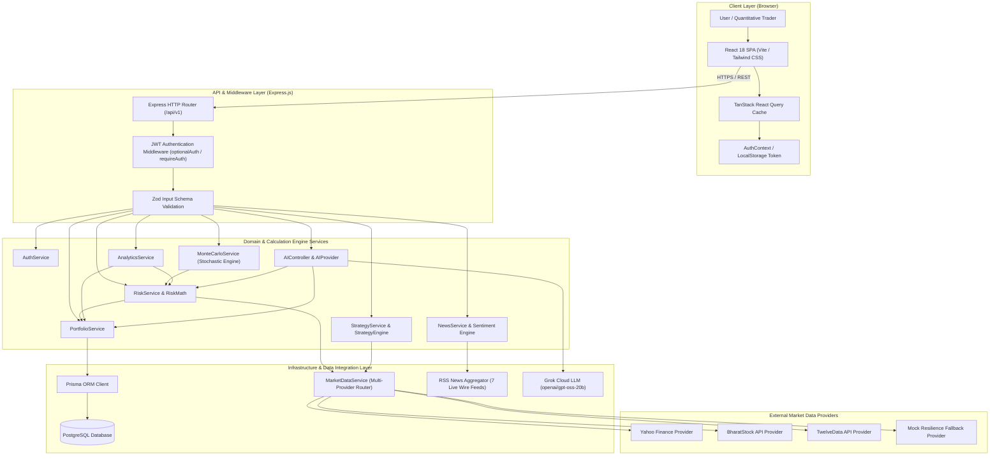
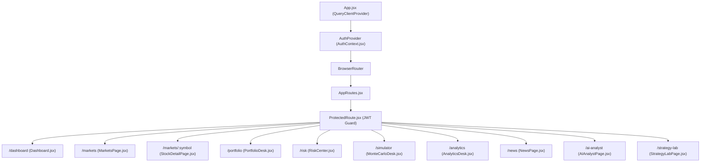
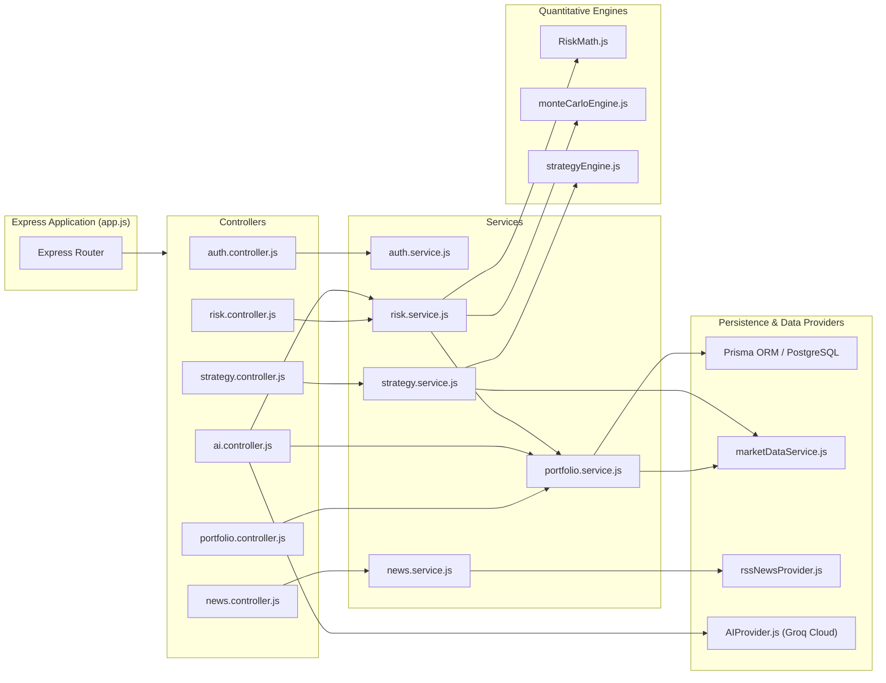
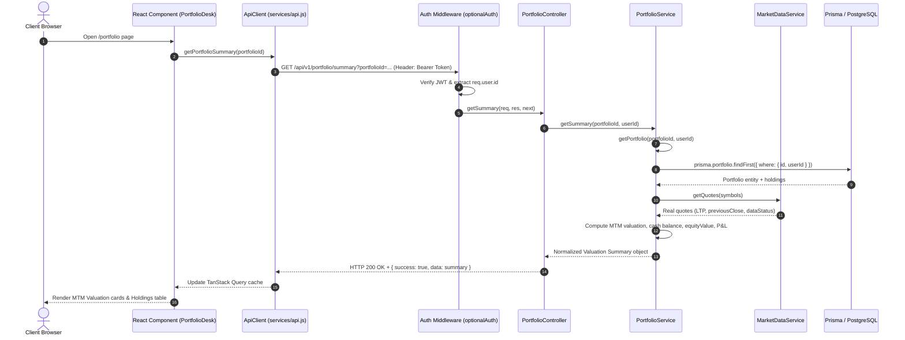
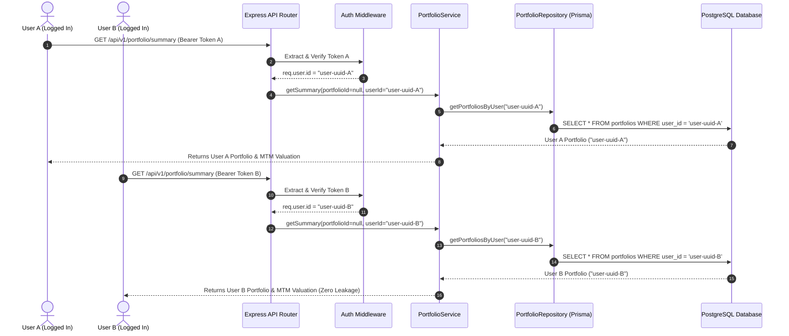
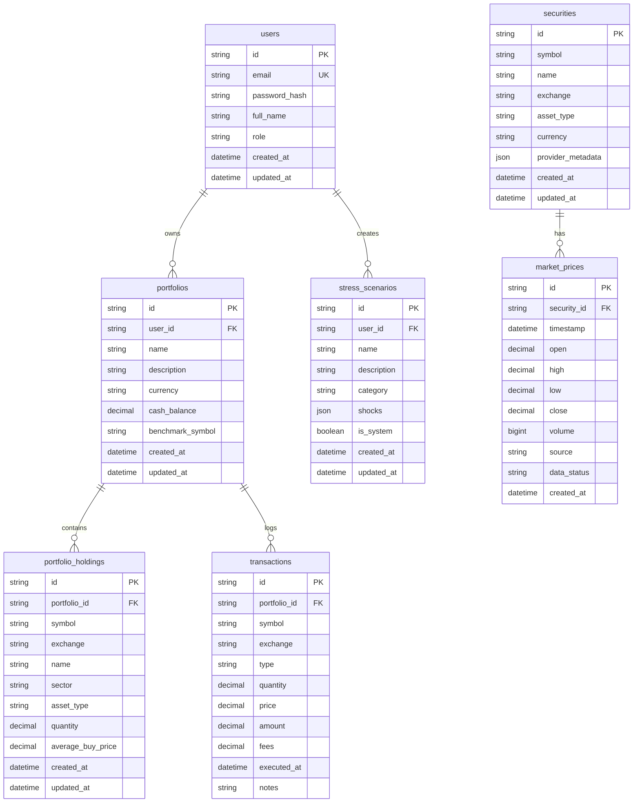
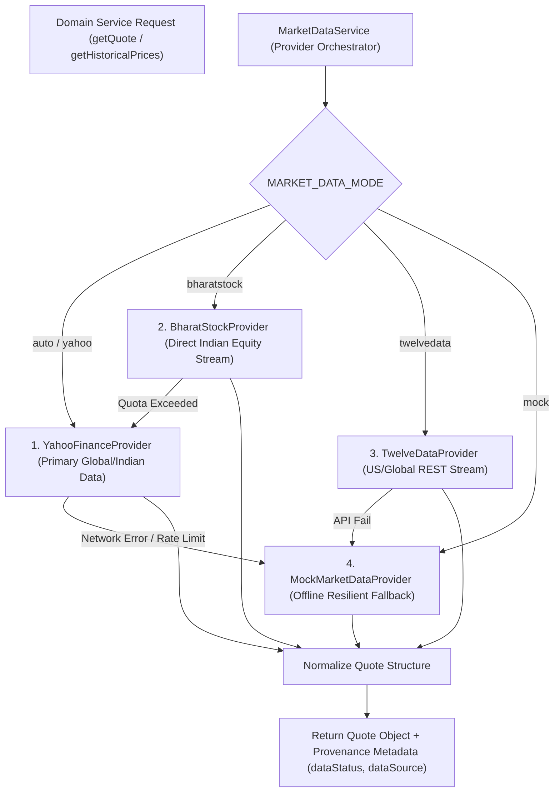

# Finance OS — Complete Technical & Quantitative Architecture Documentation

> **Document Version**: 1.0.0  
> **Source of Truth**: `d:\MAIN STUFF\Finance OS`  
> **Scope**: Sections 01 – 08 (Overview, System Architecture, Technology Stack, Codebase Structure, Authentication & Security, Database Model, API Architecture, Market Data System)

---

## 01. PROJECT OVERVIEW

### 1.1 What is Finance OS?
**Finance OS** is an institutional-grade, real-time personal finance and quantitative investment intelligence platform. Inspired by professional market terminals such as **Bloomberg Terminal** and **Refinitiv Eikon**, Finance OS bridges the gap between retail wealth tracking and institutional quantitative analysis.

Unlike generic budgeting apps or retail trading platforms that rely on simplified summaries or static mock data, Finance OS provides real-time equity valuation, stochastic risk decomposition, macro stress testing, stochastic Monte Carlo path simulation, multi-wire RSS financial news aggregation, vectorized quantitative strategy backtesting, and an AI-powered conversational financial analyst—all executed against authenticated, user-isolated real portfolio context.

### 1.2 Core Objectives
1. **Mathematical & Data Integrity**: Provide institutional-level financial analytics (Mark-to-Market valuation, Parametric & Historical Value at Risk, Conditional VaR, Sharpe/Sortino ratios, Jensen's Alpha, Portfolio Beta) calculated strictly from real market prices and verified user holdings.
2. **Zero Fake Data**: Eliminate demo fallback arrays, hardcoded return metrics, fabricated candles, and simulated flags masquerading as live data. If a provider is offline or a portfolio is empty, the system displays honest loading, empty, or `SIMULATED`/`STALE` states.
3. **Institutional UI/UX Aesthetic**: Deliver a high-density, low-latency dark-mode terminal layout featuring micro-animations, color-coded gain/loss badges, dynamic layout math, and zero intrusive popups.
4. **Strict User Isolation & Security**: Guarantee multi-tenant security where User A's cash balances, trade history, portfolio holdings, risk metrics, and AI queries can never leak to User B.
5. **Deterministic Trade & Risk Engine**: Enforce server-side trade validation, preventing execution on zero, negative, or unverified quotes, and ensuring cash reserves and position balances are updated atomically.

### 1.3 Target Audience
- **Quantitative Developers & Financial Engineers**: Seeking production-grade reference architectures for portfolio risk, stochastic simulation, and strategy backtesting.
- **Institutional & Active Traders**: Requiring real-time portfolio risk decomposition, factor exposure analysis, and macro stress testing (e.g., RBI rate hikes, broad market corrections).
- **Wealth Managers & Analysts**: Seeking conversational AI insight grounded strictly in true portfolio metrics rather than generic LLM hallucinations.

### 1.4 High-Level System Architecture Diagram



---

## 02. SYSTEM ARCHITECTURE

Finance OS is architected following **Layered Domain-Driven Design (DDD)** principles, separating UI components, API routes, domain services, quantitative math engines, infrastructure data providers, and database persistence layers.

### 2.1 Architectural Layers & Responsibilities

| Layer | Component / File Pattern | Key Responsibilities |
| :--- | :--- | :--- |
| **Frontend UI** | `frontend/src/pages/*`, `components/ui/*` | Terminal rendering, tab navigation, state management, interactive charts, real-time telemetry rendering. |
| **API Routers** | `backend/src/modules/*/*.routes.js` | Express route definition, HTTP verb mapping, auth middleware attachment, route parameter binding. |
| **Controllers** | `backend/src/modules/*/*.controller.js` | Express request/response handling, HTTP status codes, standard response formatting (`sendSuccess`). |
| **Domain Services** | `backend/src/modules/*/*.service.js` | Business logic, portfolio valuation, risk calculations, trade validation, user isolation checks. |
| **Quantitative Engines**| `riskMath.js`, `monteCarloEngine.js`, `strategyEngine.js` | Pure mathematical routines: VaR, CVaR, Box-Muller GBM paths, RSI/EMA indicators, Sharpe/Sortino ratios. |
| **Data Providers** | `backend/src/infrastructure/providers/*` | Third-party API integrations (Yahoo, TwelveData, BharatStock, Grok Cloud, RSS feeds), normalization, fallbacks. |
| **Database Access** | `backend/src/infrastructure/database/*` | Prisma client wrapper, PostgreSQL queries, resilient in-memory fallback repositories. |

### 2.2 Detailed Architecture Diagrams

#### Frontend Component Architecture


#### Backend Layered Architecture


#### Complete Request-Response Lifecycle


---

## 03. TECHNOLOGY STACK

| Technology | Category | Purpose & Role | Where Used | Selection Justification |
| :--- | :--- | :--- | :--- | :--- |
| **React 18** | Frontend Library | Declarative component UI rendering with concurrent mode features. | `frontend/src/**/*` | Industry standard for high-performance dynamic terminal UIs. |
| **Vite 6** | Build Tool & Dev Server | Ultra-fast ESM-native development server and production bundler. | `frontend/vite.config.js` | Instant hot module replacement (HMR) and optimized build times. |
| **Tailwind CSS 3** | Styling Framework | Utility-first styling for dark terminal themes and responsive layouts. | `frontend/src/index.css` | Maximum customizability without CSS file bloat; seamless dark UI. |
| **TanStack Query (v5)** | Client Data Management | Asynchronous server-state caching, automatic refetching, and stale time management. | `frontend/src/pages/*` | Prevents redundant network requests; manages backend polling cleanly. |
| **Lucide React** | Iconography | Clean, consistent financial icon suite. | `frontend/src/components/*` | Lightweight SVG icons matching institutional terminal UI styling. |
| **Node.js 24** | Runtime | Asynchronous JavaScript/ESM runtime engine. | `backend/src/server.js` | Non-blocking event loop ideal for parallel financial API orchestration. |
| **Express 4** | Web Framework | Lightweight HTTP router and middleware chain. | `backend/src/app.js` | Flexible modular route structure and established middleware ecosystem. |
| **PostgreSQL** | Database | Enterprise relational database management system. | Hosted on Neon Serverless | ACID compliance, strong schemas, foreign keys for trade ledgers. |
| **Prisma ORM 6** | ORM / DB Client | Type-safe database query builder and schema migration tool. | `backend/prisma/schema.prisma` | Prevents SQL injection; provides automated migrations and TypeScript/JS types. |
| **JSON Web Token (jsonwebtoken 9)** | Security | Stateless authentication bearer token generation and verification. | `backend/src/middleware/authMiddleware.js` | Secure multi-tenant authorization without session storage overhead. |
| **Bcrypt.js 3** | Cryptography | One-way salt hashing for user account password security. | `backend/src/modules/auth/auth.service.js` | Industry-standard password hashing preventing credential leaks. |
| **Zod 3** | Validation | Schema validation for HTTP query parameters and request bodies. | `backend/src/modules/*/*.validation.js` | Type safety and strict rejection of malformed or out-of-bounds parameters. |
| **Yahoo Finance 2** | Infrastructure | Historical candle and live quote data provider integration. | `backend/src/infrastructure/providers/YahooFinanceProvider.js` | Free access to comprehensive global and Indian equity price data. |
| **TwelveData API** | Infrastructure | Primary REST market data provider for US/Indian quotes. | `backend/src/infrastructure/providers/TwelveDataProvider.js` | High-reliability backup provider with official JSON API schemas. |
| **BharatStock API** | Infrastructure | Real-time NSE/BSE Indian equities provider. | `backend/src/infrastructure/providers/BharatStockProvider.js` | Dedicated Indian market price stream. |
| **Groq Cloud API** | AI Infrastructure | High-speed LLM inference endpoint powering Grok AI Analyst (`openai/gpt-oss-20b`). | `backend/src/infrastructure/providers/AIProvider.js` | Extremely low latency (<0.1s) for real-time financial context injection. |
| **Vitest 3** | Testing | Fast unit and integration test runner. | `backend/tests/*` | Native ESM support; fast test execution (148/148 passing tests). |

---

## 04. DIRECTORY / CODEBASE STRUCTURE

```text
Finance OS Root
├── backend
│   ├── prisma
│   │   ├── migrations/              # Database schema migrations
│   │   └── schema.prisma            # Canonical Prisma database schema
│   ├── scratch/                     # E2E verification test scripts
│   │   ├── verify_news_e2e.js
│   │   ├── verify_strategy_e2e.js
│   │   ├── verify_ai_analyst_e2e.js
│   │   ├── verify_analytics_e2e.js
│   │   └── verify_simulator_e2e.js
│   ├── src
│   │   ├── config/                  # Environment variable configuration & defaults
│   │   ├── infrastructure/          # Data providers, DB client, HTTP wrappers
│   │   │   ├── database/            # Prisma client & resilient fallback repositories
│   │   │   ├── market/              # MarketDataService multi-provider orchestrator
│   │   │   ├── news/                # RSS news aggregator & multi-feed deduplication
│   │   │   ├── providers/           # Third-party provider adapters (Yahoo, TwelveData, Grok, etc.)
│   │   │   └── redis/               # In-memory cache driver
│   │   ├── middleware/              # Authentication, request logging, error handling
│   │   ├── modules/                 # Domain-driven backend feature modules
│   │   │   ├── ai/                  # AI Analyst routes, controller & prompts
│   │   │   ├── analytics/           # Analytics Desk routes, controller & service
│   │   │   ├── auth/                # Auth routes, JWT controller & service
│   │   │   ├── market/              # Market intelligence routes & controller
│   │   │   ├── news/                # News Feed routes & controller
│   │   │   ├── portfolio/           # Portfolio Desk, holdings ledger & trade execution
│   │   │   ├── risk/                # Risk Center, Monte Carlo, stress testing & math engines
│   │   │   └── strategy/            # Strategy Lab, indicators & backtesting engine
│   │   ├── utils/                   # Logger, custom error classes, response helpers
│   │   ├── app.js                   # Express application setup & route mounting
│   │   └── server.js                # Server entry point & database initialization
│   └── tests/                       # Vitest integration test suite (17 test files)
└── frontend
    ├── src
    │   ├── components/
    │   │   ├── layout/              # Sidebar, Header, Navigation components
    │   │   └── ui/                  # Card, Badge, Button, DataStatusBadge primitives
    │   ├── context/                 # AuthContext & global state providers
    │   ├── pages/                   # Workspaces for all 10 terminal pages
    │   │   ├── AI/                  # AIAnalystPage.jsx
    │   │   ├── Analytics/           # AnalyticsDesk.jsx
    │   │   ├── Auth/                # Login.jsx, Register.jsx
    │   │   ├── Dashboard/           # Dashboard.jsx
    │   │   ├── Markets/             # MarketsPage.jsx, StockDetailPage.jsx
    │   │   ├── News/                # NewsPage.jsx
    │   │   ├── Portfolio/           # PortfolioDesk.jsx
    │   │   ├── Risk/                # RiskCenter.jsx
    │   │   ├── Settings/            # SettingsPage.jsx
    │   │   ├── Simulator/           # MonteCarloDesk.jsx
    │   │   └── Strategy/            # StrategyLabPage.jsx
    │   ├── routes/                  # AppRoutes.jsx, ProtectedRoute.jsx
    │   ├── services/                # api.js centralized API HTTP client
    │   └── utils/                   # Formatters (currency, percent, numbers)
    ├── package.json
    └── vite.config.js
```

---

## 05. AUTHENTICATION & USER SECURITY

### 5.1 Authentication Lifecycle
Finance OS implements stateless **JSON Web Token (JWT)** authentication backed by bcrypt salted password hashing (`10` rounds).

1. **Registration (`POST /api/v1/auth/register`)**:
   - Validates `email`, `password` (minimum 8 characters), and `fullName` via Zod.
   - Checks user collision in `userRepository.findByEmail(email)`.
   - Hashes password using `bcrypt.hash(password, 10)`.
   - Creates `User` record in PostgreSQL database.
   - Automatically initializes a clean `Primary Investment Portfolio` for the new user with ₹0 initial balance and zero holdings.
   - Returns signed JWT token (`expiresIn: '7d'`) and User DTO (excluding `passwordHash`).

2. **Login (`POST /api/v1/auth/login`)**:
   - Verifies user existence and compares password via `bcrypt.compare(password, user.passwordHash)`.
   - Returns signed JWT token upon success.

3. **Session Verification (`GET /api/v1/auth/me`)**:
   - Revalidates current bearer token and returns authenticated user details.

4. **Middleware Protection (`backend/src/middleware/authMiddleware.js`)**:
   - `requireAuth`: Extracts `Authorization: Bearer <token>`, verifies signature with `JWT_SECRET`, attaches decoded payload to `req.user`, or returns `HTTP 401 Unauthorized`.
   - `optionalAuth`: Verifies token if present and attaches `req.user`; if unauthenticated, sets `req.user = null` without blocking public/guest preview requests.

### 5.2 User Isolation Architecture



### 5.3 Multi-Tenant Security Boundaries

| Resource | Isolation Mechanism | Verification Enforcement |
| :--- | :--- | :--- |
| **Portfolios** | Scoped to `userId` | `portfolioRepository.getPortfoliosByUser(userId)` enforces strict `where: { userId }` clause. |
| **Transactions** | Scoped to `portfolioId` owned by user | `portfolioService.executeTransaction` verifies portfolio ownership prior to inserting trade logs. |
| **Risk Center** | Computed from user's holdings | `riskService.getRiskMetrics(portfolioId, userId)` computes metrics from verified owned holdings. |
| **Monte Carlo** | Ingests user's actual portfolio value | Initial simulation value `S0` is loaded from authenticated user's portfolio MTM valuation. |
| **Strategy History**| Scoped to `req.user.id` | `strategyService.getUserHistory(userId)` returns backtest runs belonging strictly to the session user. |
| **AI Analyst** | Injects user's valuation context | `AIController` injects authenticated user's exact equity/cash metrics into LLM system prompts. |

---

## 06. DATABASE & DATA MODEL

Finance OS uses **PostgreSQL** managed through **Prisma ORM**. All table names use snake_case mapping (`@@map`), while models use PascalCase.

### 6.1 Database Entity-Relationship (ER) Diagram



### 6.2 Data Model Definitions

#### `User` Model (`users`)
- **Primary Key**: `id` (`UUID`)
- **Unique Fields**: `email` (`String`)
- **Fields**: `passwordHash`, `fullName`, `role` (`USER`, `ANALYST`, `ADMIN`), `createdAt`, `updatedAt`
- **Relations**: Has many `Portfolio`, has many `StressScenario`.
- **Purpose**: Stores authenticated platform users.

#### `Portfolio` Model (`portfolios`)
- **Primary Key**: `id` (`UUID`)
- **Foreign Key**: `userId` -> `User.id` (`onDelete: Cascade`)
- **Fields**: `name`, `description`, `currency` (default `'INR'`), `cashBalance` (`Decimal(18,4)`), `benchmarkSymbol` (default `'NIFTY 50'`), `createdAt`, `updatedAt`
- **Relations**: Belongs to `User`, has many `PortfolioHolding`, has many `Transaction`.
- **Purpose**: Core entity tracking account cash reserves, currency, and asset allocations.

#### `PortfolioHolding` Model (`portfolio_holdings`)
- **Primary Key**: `id` (`UUID`)
- **Foreign Key**: `portfolioId` -> `Portfolio.id` (`onDelete: Cascade`)
- **Unique Index**: `[portfolioId, symbol, exchange]`
- **Fields**: `symbol`, `exchange` (default `'NSE'`), `name`, `sector`, `assetType` (default `'EQUITY'`), `quantity` (`Decimal(18,4)`), `averageBuyPrice` (`Decimal(18,4)`), `createdAt`, `updatedAt`
- **Purpose**: Represents position holdings with volume and weighted average cost basis.

#### `Transaction` Model (`transactions`)
- **Primary Key**: `id` (`UUID`)
- **Foreign Key**: `portfolioId` -> `Portfolio.id` (`onDelete: Cascade`)
- **Fields**: `symbol`, `exchange`, `type` (`BUY`, `SELL`, `DEPOSIT`, `WITHDRAWAL`), `quantity`, `price`, `amount`, `fees`, `executedAt`, `notes`
- **Purpose**: Immutable financial ledger auditing trade executions and cash movements.

#### `Security` & `MarketPrice` Models (`securities`, `market_prices`)
- **Security Unique Key**: `[symbol, exchange]`
- **MarketPrice Unique Index**: `[securityId, timestamp]`
- **Fields**: Tracks OHLCV candle records, data source (`yahoo`, `twelvedata`, `bharatstock`, `mock`), and data status (`LIVE`, `DELAYED`, `EOD`, `HISTORICAL`, `SIMULATED`).

---

## 07. API ARCHITECTURE

All REST API endpoints are hosted under `/api/v1` and communicate via JSON payloads.

### 7.1 Complete API Endpoint Reference Matrix

| Module | Method | Endpoint | Auth | Purpose & Service Called |
| :--- | :--- | :--- | :--- | :--- |
| **Auth** | `POST` | `/api/v1/auth/register` | Public | Registers user and creates primary portfolio. Calls `authService.register()`. |
| **Auth** | `POST` | `/api/v1/auth/login` | Public | Authenticates credentials and issues JWT token. Calls `authService.login()`. |
| **Auth** | `GET` | `/api/v1/auth/me` | Bearer | Revalidates current session token. Calls `authService.getMe()`. |
| **Market**| `GET` | `/api/v1/market/quote/:symbol` | Optional | Fetches normalized equity quote. Calls `marketDataService.getQuote()`. |
| **Market**| `GET` | `/api/v1/market/quotes?symbols=...`| Optional | Fetches batch market quotes. Calls `marketDataService.getQuotes()`. |
| **Market**| `GET` | `/api/v1/market/movers` | Optional | Fetches top market gainers & losers. Calls `marketDataService.getTopMovers()`. |
| **Market**| `GET` | `/api/v1/market/history/:symbol` | Optional | Fetches historical OHLCV candles. Calls `marketDataService.getHistoricalPrices()`. |
| **Market**| `GET` | `/api/v1/market/status` | Optional | Returns overall market open/closed status. Calls `marketDataService.getMarketStatus()`. |
| **Portfolio**|`GET`| `/api/v1/portfolio/list` | Bearer | Lists user portfolios. Calls `portfolioService.getPortfolios()`. |
| **Portfolio**|`GET`| `/api/v1/portfolio/summary` | Bearer | Computes MTM valuation & P&L summary. Calls `portfolioService.getSummary()`. |
| **Portfolio**|`GET`| `/api/v1/portfolio/holdings` | Bearer | Returns position holdings with LTP. Calls `portfolioService.getHoldings()`. |
| **Portfolio**|`GET`| `/api/v1/portfolio/allocations`| Bearer | Returns sector & asset allocations. Calls `portfolioService.getAllocations()`. |
| **Portfolio**|`POST`|`/api/v1/portfolio/transactions`| Bearer | Validates & executes trade/deposit. Calls `portfolioService.executeTransaction()`. |
| **Risk** | `GET` | `/api/v1/risk/snapshot` | Bearer | Computes Risk Center command cards. Calls `riskService.getSnapshot()`. |
| **Risk** | `GET` | `/api/v1/risk/metrics` | Bearer | Computes VaR, CVaR, Sharpe, Beta. Calls `riskService.getRiskMetrics()`. |
| **Risk** | `GET` | `/api/v1/risk/correlation` | Bearer | Computes position correlation matrix. Calls `riskService.getCorrelationMatrix()`. |
| **Risk** | `POST` | `/api/v1/risk/stress-test` | Bearer | Evaluates macro stress scenario impact. Calls `riskService.evaluateStressTest()`. |
| **Simulator**|`POST`|`/api/v1/risk/monte-carlo` | Bearer | Runs Stochastic Monte Carlo simulation. Calls `riskService.runMonteCarlo()`. |
| **Analytics**|`GET`| `/api/v1/analytics/summary` | Bearer | Computes Analytics KPIs & trade stats. Calls `analyticsService.getAnalyticsSummary()`. |
| **Analytics**|`GET`| `/api/v1/analytics/attribution`| Bearer | Computes performance attribution. Calls `analyticsService.getAttribution()`. |
| **News** | `GET` | `/api/v1/news` | Optional | Fetches RSS news feed with deduplication. Calls `newsService.getFeed()`. |
| **News** | `GET` | `/api/v1/news/health` | Public | Returns status of all 7 RSS wire feeds. Calls `newsService.getHealth()`. |
| **Strategy**| `GET` | `/api/v1/strategy/templates` | Optional | Returns strategy templates. Calls `strategyService.getTemplates()`. |
| **Strategy**| `POST`| `/api/v1/strategy/backtest` | Optional | Runs quant strategy backtest. Calls `strategyService.runBacktest()`. |
| **AI** | `GET` | `/api/v1/ai/insight` | Optional | Generates Grok AI portfolio insight. Calls `aiController.getFinancialInsight()`. |
| **AI** | `POST`| `/api/v1/ai/query` | Optional | Processes conversational user query. Calls `aiController.processQuery()`. |

---

## 08. MARKET DATA SYSTEM

### 8.1 Multi-Provider Routing Architecture

The `MarketDataService` operates as a resilient multi-provider router, abstracting external price streams from internal domain services.



### 8.2 Symbol Normalization Rules
`SymbolNormalizer` handles cross-exchange mapping:
- Indian equities automatically append `.NS` for Yahoo queries (e.g. `RELIANCE` -> `RELIANCE.NS`, `HDFCBANK` -> `HDFCBANK.NS`).
- Benchmark indices map to canonical symbols (`NIFTY 50` -> `^NSEI`, `SENSEX` -> `^BSESN`).

### 8.3 Data Provenance & Truthful Status Flags

Finance OS explicitly tracks data provenance across all responses. Provenance is **never fabricated**:

| Data Status | Definition & Trigger Condition |
| :--- | :--- |
| **`LIVE`** | Real-time quote fetched directly from active market API provider. |
| **`DELAYED`** | Exchange-delayed quote (e.g., 15-minute delayed Yahoo stream). |
| **`EOD`** | End-of-day official settlement price. |
| **`STALE` / `CACHED`** | Returned from backend in-memory cache during transient API downtime. |
| **`HISTORICAL`** | Real historical candle data ingested for backtesting or chart plotting. |
| **`SIMULATED`** | Strictly reserved for offline dev sandbox mode or mock test provider; **NEVER labeled as LIVE**. |

---
