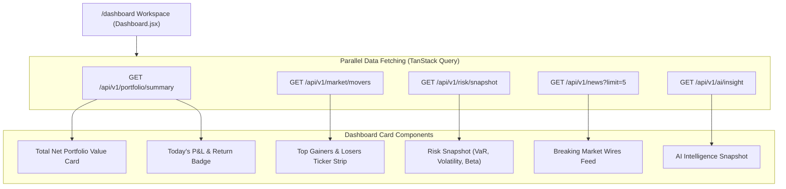
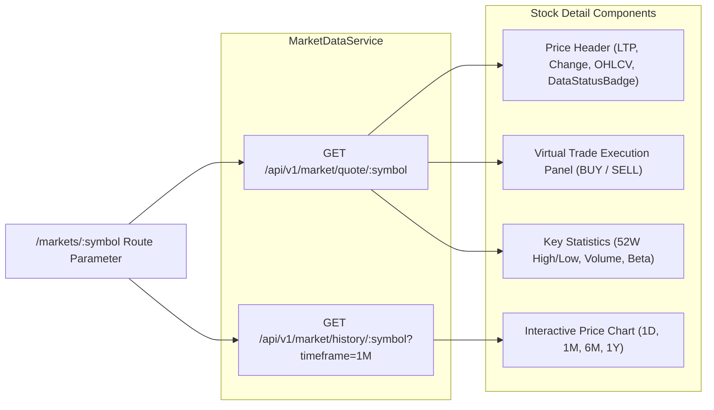
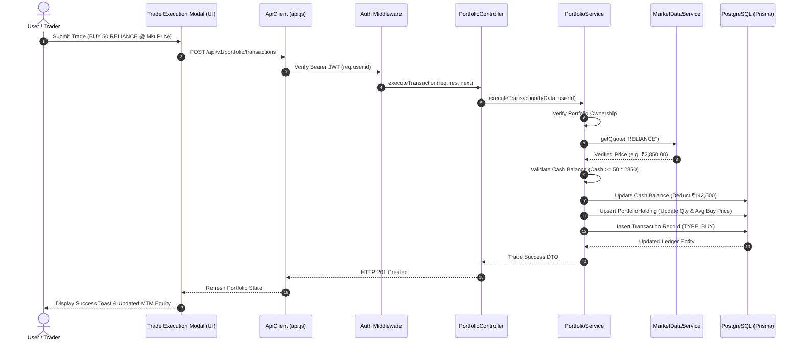
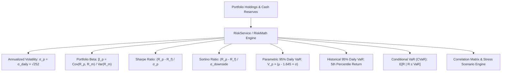
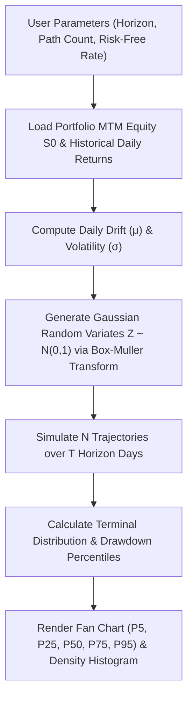
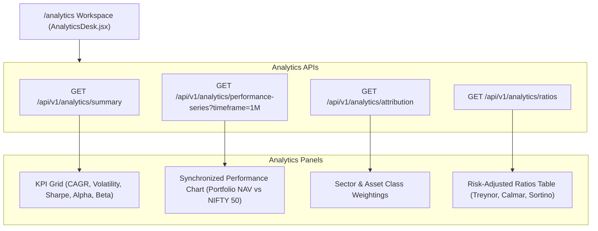
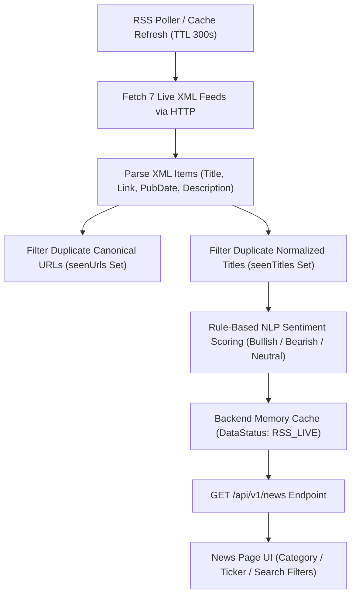
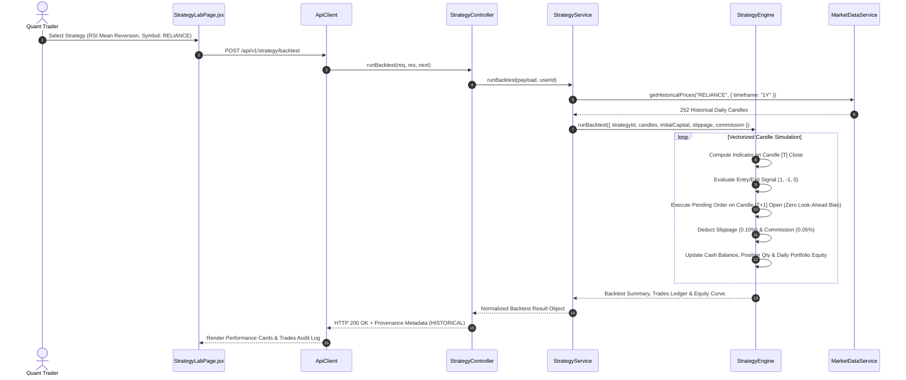
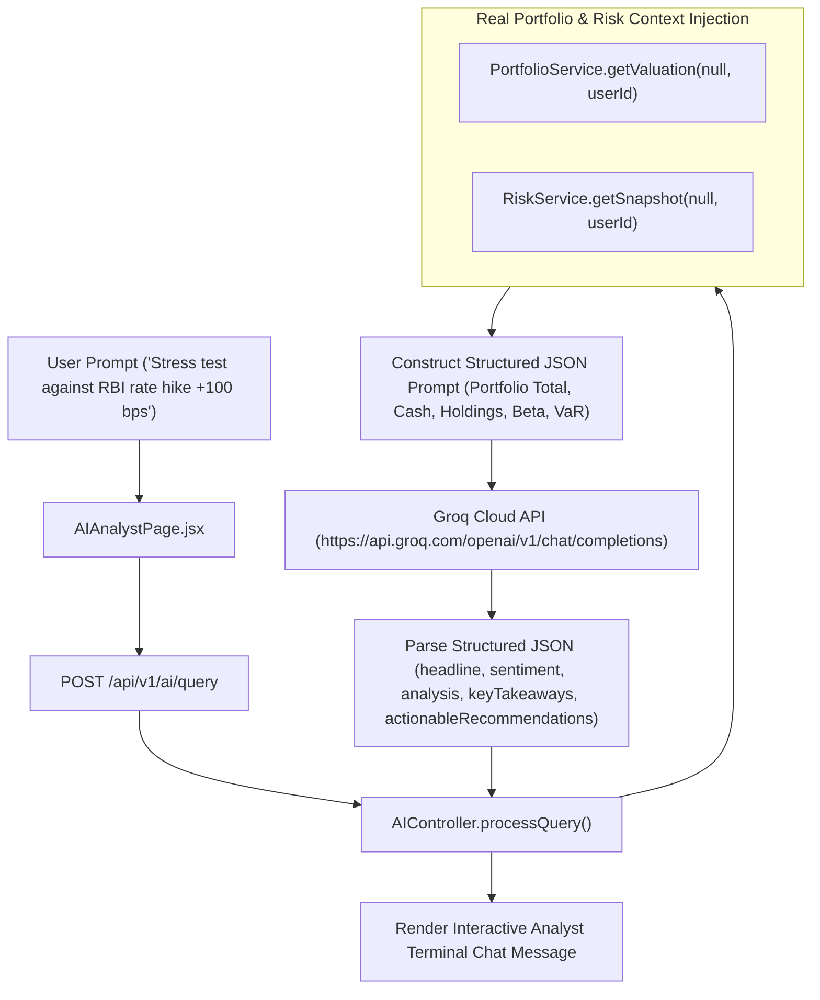

# Finance OS — Complete Technical & Quantitative Architecture Documentation (Part 2)

> **Document Version**: 1.0.0  
> **Source of Truth**: `d:\MAIN STUFF\Finance OS`  
> **Scope**: Sections 09 – 17 (Workspace Pages & Domain Engine Deep Dives: Dashboard, Markets, Portfolio Desk, Risk Center, Monte Carlo Simulator, Analytics Desk, News Feed, Strategy Lab, AI Analyst)

---

## 09. DASHBOARD

### 9.1 Purpose & Overview
The **Executive Command Dashboard** (`/dashboard`) serves as the institutional landing workspace, synthesizing multi-desk telemetry into a unified, high-density terminal overview. It aggregates mark-to-market valuation, portfolio P&L, real-time index tickers, top market movers, risk snapshot metrics, recent RSS news alerts, and auto-generated Grok AI portfolio insights.



### 9.2 Data Sources & Calculations
- **Net Portfolio Value**: Calculated on backend via `portfolioService.getValuation()`. Sums total cash balance and priced holdings equity value.
- **Today's P&L**: Sums `qty * (ltp - previousClose)` across all active position holdings.
- **Market Movers**: Ingests real-time NSE gainers and losers sorted by percent change via `marketDataService.getTopMovers()`.
- **Risk Snapshot**: Displays Parametric 95% Daily VaR, annualized volatility, and composite portfolio beta via `riskService.getSnapshot()`.
- **AI Intelligence Snapshot**: Ingests structured portfolio insight generated by Grok Cloud LLM via `AIController.getFinancialInsight()`.

### 9.3 State Handling
- **Loading State**: Rendered via low-friction skeleton cards during asynchronous data resolution.
- **Empty State (Fresh User)**: Displays ₹0 net portfolio value, ₹0 cash, 0 active holdings, and a helpful prompt guiding the user to fund virtual capital or execute a trade from the Market Master.
- **Error State**: Non-blocking graceful degradation; if news RSS or AI endpoint experiences temporary latency, remaining portfolio telemetry cards render without crashing the page.

---

## 10. MARKETS DESK (`/markets` & `/markets/:symbol`)

### 10.1 Markets Overview (`/markets`)
The **Markets Desk** (`MarketsPage.jsx`) provides real-time market intelligence across Indian (NSE/BSE) and global indices, individual equities, currencies, and top gainers/losers.

- **Index Ticker Bar**: Displays live prices and 24h changes for `NIFTY 50`, `SENSEX`, `S&P 500`, `NASDAQ`, `USD/INR`, and `GOLD`.
- **Market Master Table**: Interactive grid featuring search filter (`q`), exchange filter (`NSE`, `BSE`, `NASDAQ`), asset class toggle, LTP, Day High/Low, and Volume.
- **Movers Widget**: Highlights top 5 market gainers and top 5 market losers with percentage change badges.
- **Data Status Badges**: Displays `LIVE` for active exchange data, `DELAYED` for 15-min Yahoo data, or `SIMULATED` in offline sandbox mode.

### 10.2 Stock Detail Workspace (`/markets/:symbol`)
The **Stock Detail Desk** (`StockDetailPage.jsx`) delivers granular single-instrument telemetry for any selected symbol (e.g. `/markets/RELIANCE` or `/markets/HDFCBANK`).



- **Price Chart**: Interactive price visualization rendering historical candles ingested from `marketDataService.getHistoricalPrices(symbol, { timeframe })`.
- **Virtual Trade Widget**: Allows logged-in users to execute instant BUY or SELL market orders directly from the instrument workspace.

---

## 11. PORTFOLIO DESK

### 11.1 Purpose & Architecture
The **Portfolio Desk** (`/portfolio`) is the primary accounting workspace for portfolio management, mark-to-market valuation, sector asset allocation, and trade ledger audits.



### 11.2 Mark-to-Market (MTM) Valuation Mathematics
For every active holding \(i\) in portfolio \(P\):
- **Last Traded Price (\(\text{LTP}_i\))**: Live price from `MarketDataService`.
- **Cost Basis (\(\text{Cost}_i\))**: \(\text{Quantity}_i \times \text{AverageBuyPrice}_i\)
- **Current Market Value (\(\text{Value}_i\))**: \(\text{Quantity}_i \times \text{LTP}_i\)
- **Unrealized Position P&L (\(\text{Pnl}_i\))**: \(\text{Value}_i - \text{Cost}_i\)
- **Unrealized Position P&L %**: \(\frac{\text{Value}_i - \text{Cost}_i}{\text{Cost}_i} \times 100\)
- **Today's Position P&L**: \(\text{Quantity}_i \times (\text{LTP}_i - \text{PreviousClose}_i)\)
- **Portfolio Total Net Value**: \(\text{CashBalance} + \sum_{i} \text{Value}_i\)
- **Portfolio Allocation Weight %**: \(\frac{\text{Value}_i}{\text{TotalValue}} \times 100\)

### 11.3 Server-Side Trade Safety & Verification Rules
1. **Price Verification**: Trade execution NEVER trusts user-submitted prices from the frontend. The backend fetches and verifies the live quote from `MarketDataService`.
2. **Cash Reserve Validation**: For `BUY` orders, backend enforces \(\text{CashBalance} \ge (\text{Quantity} \times \text{VerifiedLTP}) + \text{Fees}\). If cash is insufficient, returns `HTTP 400 Bad Request`.
3. **Position Ownership Validation**: For `SELL` orders, backend enforces \(\text{HoldingQuantity} \ge \text{SellQuantity}\). Attempting to oversell throws `BadRequestError`.
4. **Weighted Average Cost Basis Update**: When executing a subsequent `BUY` order of quantity \(q_2\) at price \(p_2\) for existing holding \((q_1, p_1)\):
   \[
   \text{NewAvgPrice} = \frac{(q_1 \times p_1) + (q_2 \times p_2)}{q_1 + q_2}
   \]

---

## 12. RISK CENTER

### 12.1 Purpose & Metrics
The **Risk Center** (`/risk`) provides quantitative risk metrics, factor exposures, correlation matrix decomposition, and macro stress testing.



### 12.2 Mathematically Honest Empty Portfolio Handling
When a user has an unallocated portfolio (\(\text{TotalValue} = 0\) or cash only with 0 equity holdings):
- **Annualized Volatility**: `0.00%`
- **Portfolio Beta**: `0.00`
- **Sharpe Ratio**: `0.00`
- **95% Daily VaR**: `₹0`
- **Expected Shortfall (CVaR)**: `₹0`
- **Risk Level**: `CONSERVATIVE` / `LOW`
- **Key Concern**: *"All capital is currently held in cash (zero equity market risk exposure)."*

Finance OS **NEVER** generates synthetic mock return series or non-zero fake risk metrics for empty portfolios.

### 12.3 Built-in Macro Stress Scenarios

| Scenario ID | Name | Category | Shock Parameters |
| :--- | :--- | :--- | :--- |
| `rbi_hike` | RBI Interest Rate Hike (+100 bps) | MACRO | Banking `-4.5%`, Rate-Sensitives `-3.0%`, Market `-1.5%` |
| `tech_correction` | Technology Sector Selloff (-15%) | SECTOR | Tech & IT Holdings `-15.0%` |
| `crude_spike` | Crude Oil Price Shock (+25%) | GEOPOLITICAL | Aviation/Paint `-8.0%`, Energy `+4.0%`, Market `-2.5%` |
| `broad_correction`| Broad Market Correction (-10%) | MACRO | All Equities `-10.0%` |

---

## 13. MONTE CARLO SIMULATOR

### 13.1 Stochastic Engine & Geometric Brownian Motion (GBM)
The **Monte Carlo Simulator** (`/simulator`) models thousands of potential future portfolio value trajectories using **Geometric Brownian Motion (GBM)**.



### 13.2 Mathematical Formulas
For trajectory \(k\) at step \(t + \Delta t\):
\[
S_k(t + \Delta t) = S_k(t) \times \exp\left( \left(\mu - \frac{1}{2}\sigma^2\right)\Delta t + \sigma \sqrt{\Delta t} Z_{k,t} \right)
\]
Where:
- \(S(0)\): Initial portfolio valuation (MTM equity + cash).
- \(\mu\): Daily expected return drift derived from historical log returns.
- \(\sigma\): Daily return volatility.
- \(\Delta t\): Time step (\(1/252\) trading days).
- \(Z_{k,t}\): Independent standard normal random variable generated via Box-Muller transform:
  \[
  Z = \sqrt{-2 \ln U_1} \cos(2\pi U_2) \quad \text{where } U_1, U_2 \sim \text{Uniform}(0,1)
  \]

### 13.3 Output Percentiles & Risk Analytics
- **P5 (Worst Case 5th Percentile)**: Lower tail value at horizon.
- **P50 (Median Trajectory)**: Median expected portfolio valuation.
- **P95 (Best Case 95th Percentile)**: Upper tail optimistic valuation.
- **Probability of Loss**: \(\frac{\text{Count}(S_{\text{terminal}} < S_0)}{N} \times 100\)
- **Target Hurdle Probability**: Percentage of simulated paths exceeding user-defined target return.

---

## 14. ANALYTICS DESK

### 14.1 Purpose & Telemetry Scope
The **Analytics Desk** (`/analytics`) provides comprehensive performance attribution, ratios, and benchmark tracking against the **NIFTY 50** index.



### 14.2 Key Performance Ratios Formulas

- **Treynor Ratio**:
  \[
  \text{Treynor} = \frac{R_p - R_f}{\beta_p}
  \]
- **Calmar Ratio**:
  \[
  \text{Calmar} = \frac{\text{CAGR}}{|\text{MaxDrawdown}|}
  \]
- **Jensen's Alpha**:
  \[
  \alpha = R_p - \left[ R_f + \beta_p (R_m - R_f) \right]
  \]
- **Sortino Ratio**:
  \[
  \text{Sortino} = \frac{R_p - R_f}{\sigma_{\text{downside}}}
  \]

---

## 15. NEWS FEED

### 15.1 Architecture & Multi-Feed Aggregation
The **News Feed** (`/news`) aggregates financial news wires from **7 major Indian news publishers**:
1. Economic Times Markets
2. Moneycontrol Top News
3. NDTV Profit Markets
4. Livemint Market Wires
5. Business Standard Finance
6. Zee Business Markets
7. Financial Express Equities



### 15.2 Rule-Based Financial NLP Sentiment Analysis
- **Bullish Indicators**: Keywords (`surge`, `jump`, `profit up`, `record high`, `rally`, `growth`, `outperform`, `buy rating`). Score: `+1.0`.
- **Bearish Indicators**: Keywords (`plunge`, `slump`, `loss`, `decline`, `downgrade`, `selloff`, `crash`, `inflation hike`). Score: `-1.0`.
- **Classification**: Score `> 0.2` -> `BULLISH`, Score `< -0.2` -> `BEARISH`, else `NEUTRAL`.

### 15.3 Truthful Provenance Badges
- **`RSS_LIVE`**: Active live RSS wire connection.
- **`STALE` / `CACHED`**: Returned from cache during wire network timeout.
- **`SIMULATED`**: Strictly reserved for unit tests or offline sandbox mode.

---

## 16. STRATEGY LAB / QUANT BACKTESTER

### 16.1 Quant Backtest Architecture & Zero Look-Ahead Bias
The **Strategy Lab** (`/strategy-lab`) allows quantitative traders to backtest algorithmic trading strategies against real historical daily price candles.



### 16.2 Quantitative Indicator Formulas
- **Wilder Relative Strength Index (RSI)**:
  \[
  \text{RSI}_t = 100 - \frac{100}{1 + \text{RS}_t} \quad \text{where } \text{RS}_t = \frac{\text{SmootherGain}_t}{\text{SmootherLoss}_t}
  \]
- **Exponential Moving Average (EMA)**:
  \[
  \text{EMA}_t = \left(\text{Close}_t - \text{EMA}_{t-1}\right) \times \left(\frac{2}{N+1}\right) + \text{EMA}_{t-1}
  \]
- **MACD Line & Signal Line**:
  \[
  \text{MACD}_t = \text{EMA}_{12}(t) - \text{EMA}_{26}(t), \quad \text{Signal}_t = \text{EMA}_{9}(\text{MACD}_t)
  \]

---

## 17. AI ANALYST

### 17.1 Architecture & Grok Cloud Integration
The **AI Financial Analyst Desk** (`/ai-analyst`) provides real-time conversational financial intelligence powered by **Grok Cloud LLM** (`openai/gpt-oss-20b`).



### 17.2 Prompt Context Construction & Schema Enforcement
- **System Prompt**: Enforces institutional equity analyst persona and restricts output format strictly to raw JSON.
- **Portfolio Context Injected**:
  - Net Portfolio Valuation & Cash Balance
  - Top 6 Equity Holdings with allocations & LTPs
  - Portfolio Beta, Sharpe Ratio, Risk Level, Daily 95% VaR
  - User Query / Specific Macro Scenario
- **Structured JSON Schema Output**:
  ```json
  {
    "headline": "Short institutional summary headline",
    "sentiment": "BULLISH" | "CAUTIONARY" | "BEARISH" | "NEUTRAL",
    "confidence": 0.88,
    "analysis": "2-3 institutional sentences analyzing portfolio impact.",
    "keyTakeaways": ["takeaway 1", "takeaway 2", "takeaway 3"],
    "actionableRecommendations": ["recommendation 1", "recommendation 2"]
  }
  ```

---
