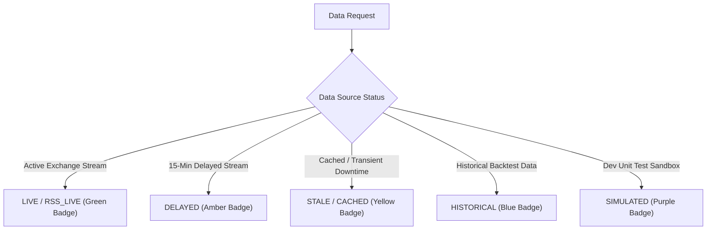
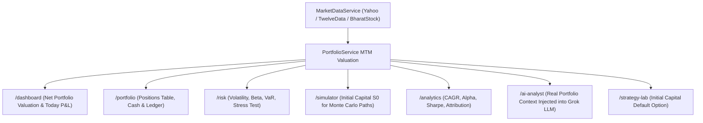
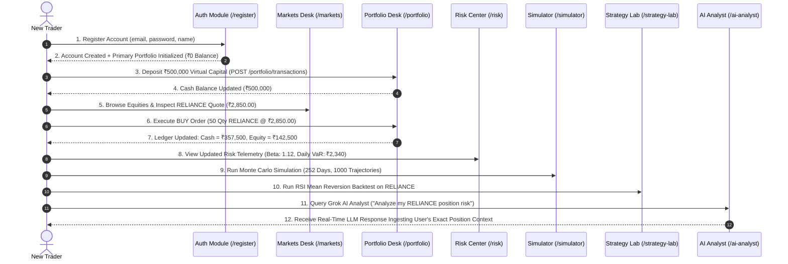
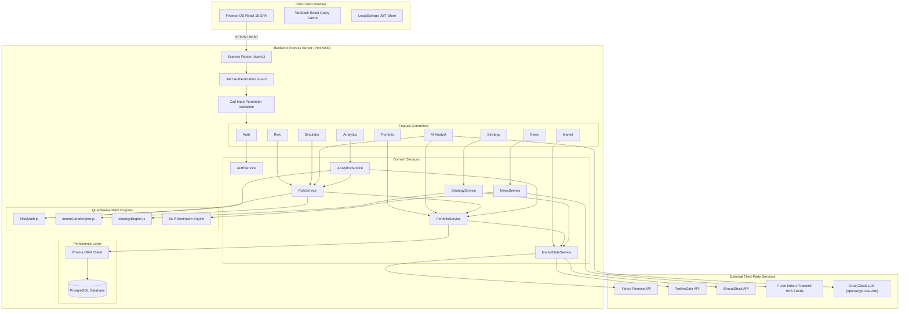

# Finance OS — Complete Technical & Quantitative Architecture Documentation (Part 3)

> **Document Version**: 1.0.0  
> **Source of Truth**: `d:\MAIN STUFF\Finance OS`  
> **Scope**: Sections 18 – 33 (Financial Mathematics, Quantitative Methods, Data Integrity, Empty States, Testing Strategy, Cross-Page Consistency, Security, Production Audit, Limitations, Interview Guide, Design Decisions, Failure Scenarios, End-to-End Walkthrough, Glossary, Quick Reference, Master Architecture Map)

---

## 18. FINANCIAL MATHEMATICS

This chapter provides complete mathematical definitions, formulas, variable explanations, step-by-step INR examples, and edge case rules for all core financial formulas used across Finance OS.

### 18.1 Mark-to-Market (MTM) Portfolio Valuation
- **Definition**: The real-time liquidation value of a portfolio based on current market prices.
- **Formula**:
  \[
  V_{\text{total}} = C + \sum_{i=1}^{N} (q_i \cdot P_{i,\text{LTP}})
  \]
  Where \(C\) = cash balance, \(q_i\) = position quantity, \(P_{i,\text{LTP}}\) = Last Traded Price.
- **Example**: Cash = ₹100,000. Holding 50 RELIANCE @ ₹2,800 + 100 HDFCBANK @ ₹1,650.  
  \(V_{\text{total}} = 100,000 + (50 \times 2,800) + (100 \times 1,650) = 100,000 + 140,000 + 165,000 = \text{₹405,000}\).

### 18.2 Position Unrealized & Today's P&L
- **Unrealized P&L**: \(P\text{nL}_i = q_i \cdot (P_{i,\text{LTP}} - P_{i,\text{avg}})\)
- **Today's P&L**: \(P\text{nL}_{i,\text{today}} = q_i \cdot (P_{i,\text{LTP}} - P_{i,\text{prevClose}})\)
- **Today's Portfolio P&L %**: \(\frac{\sum P\text{nL}_{i,\text{today}}}{V_{\text{total}} - \sum P\text{nL}_{i,\text{today}}} \times 100\)

### 18.3 Annualized Portfolio Volatility (\(\sigma_p\))
- **Definition**: Standard deviation of daily log returns scaled to an annual basis assuming 252 trading days.
- **Formula**:
  \[
  \sigma_{\text{daily}} = \sqrt{\frac{1}{M-1} \sum_{t=1}^{M} (r_t - \bar{r})^2}, \quad \sigma_{\text{annual}} = \sigma_{\text{daily}} \times \sqrt{252} \times 100
  \]
- **Interpretation**: Higher volatility indicates greater price dispersion and uncertainty.

### 18.4 Portfolio Beta (\(\beta_p\))
- **Definition**: Sensitivity of portfolio excess returns relative to benchmark market returns (NIFTY 50).
- **Formula**:
  \[
  \beta_p = \frac{\text{Cov}(R_p, R_m)}{\text{Var}(R_m)}
  \]
- **Interpretation**: \(\beta = 1.0\): moves in tandem with market. \(\beta = 1.25\): 25% more volatile than benchmark.

### 18.5 Sharpe Ratio
- **Definition**: Measure of risk-adjusted return per unit of total annualized volatility.
- **Formula**:
  \[
  \text{Sharpe} = \frac{R_p - R_f}{\sigma_p}
  \]
  Where \(R_p\) = annualized portfolio return, \(R_f\) = annual risk-free rate (default `6.5%`), \(\sigma_p\) = annualized volatility.
- **Example**: Portfolio return = 18.5%, Risk-free = 6.5%, Volatility = 12.0%.  
  \(\text{Sharpe} = \frac{0.185 - 0.065}{0.120} = 1.00\).

### 18.6 Sortino Ratio
- **Definition**: Risk-adjusted return metric considering only downside (negative) volatility.
- **Formula**:
  \[
  \text{Sortino} = \frac{R_p - R_f}{\sigma_{\text{downside}}} \quad \text{where } \sigma_{\text{downside}} = \sqrt{\frac{1}{M} \sum_{t=1}^{M} \min(0, r_t - R_f)^2} \times \sqrt{252}
  \]

### 18.7 Parametric & Historical Value at Risk (VaR 95%)
- **Parametric VaR**: Assumes normal distribution of daily returns:
  \[
  \text{VaR}_{95, \text{daily}} = V_{\text{equity}} \times \left| \mu_{\text{daily}} - 1.645 \cdot \sigma_{\text{daily}} \right|
  \]
- **Historical VaR**: 5th percentile of sorted historical daily returns over lookback period.

### 18.8 Conditional Value at Risk (CVaR / Expected Shortfall)
- **Definition**: Average expected loss given that loss exceeds the 95% VaR threshold.
- **Formula**:
  \[
  \text{CVaR}_{95} = \text{E} \left[ L \mid L \ge \text{VaR}_{95} \right]
  \]

### 18.9 Maximum Drawdown (MDD)
- **Definition**: Maximum peak-to-trough percentage contraction in portfolio net asset value.
- **Formula**:
  \[
  \text{MDD} = \max_{t \ge s} \left( \frac{V_{\text{peak}, s} - V_t}{V_{\text{peak}, s}} \right) \times 100
  \]

---

## 19. QUANTITATIVE METHODS

### 19.1 Geometric Brownian Motion (GBM) for Monte Carlo Path Generation
The stochastic engine models continuous-time asset trajectories via SDE:
\[
dS_t = \mu S_t dt + \sigma S_t dW_t
\]
Discretized exact log-normal transformation over step \(\Delta t\):
\[
S(t + \Delta t) = S(t) \exp\left( \left(\mu - \frac{1}{2}\sigma^2\right)\Delta t + \sigma \sqrt{\Delta t} Z_t \right)
\]
Where \(Z_t \sim \mathcal{N}(0,1)\) is sampled using Box-Muller transformation.

### 19.2 Zero Look-Ahead Bias Backtesting
In `StrategyEngine`, signals calculated on candle \(T\) close (\(P_{\text{close}, T}\)) are executed strictly on candle \(T+1\) Open price (\(P_{\text{open}, T+1}\)), incorporating a 0.10% slippage penalty and 0.05% brokerage fee:
\[
P_{\text{exec, buy}} = P_{\text{open}, T+1} \times (1 + \text{Slippage}), \quad P_{\text{exec, sell}} = P_{\text{open}, T+1} \times (1 - \text{Slippage})
\]

---

## 20. DATA PROVENANCE & DATA INTEGRITY

### 20.1 Zero Demo Data Principle
Finance OS strictly enforces a zero-fake-data policy across all workspaces:
- No hardcoded portfolio returns (`+28.45%`), static win rates (`68.5%`), or mock trade logs.
- Unallocated portfolios produce mathematically honest zero states.
- Provider downtime or rate limits output honest `CACHED` or `STALE` badges rather than claiming `LIVE`.

### 20.2 Data Provenance Badges Summary



---

## 21. EMPTY STATE & EDGE CASE DESIGN

| Workspace | Trigger Condition | Backend Response | Frontend Display |
| :--- | :--- | :--- | :--- |
| **Portfolio Desk** | Fresh user (0 holdings, ₹0 cash) | `{ holdings: [], summary: { totalValue: 0, cashBalance: 0 } }` | Displays ₹0 Net Value card, empty positions table, "+ Deposit Cash" prompt. |
| **Risk Center** | Portfolio equity = ₹0 | `{ riskScore: 0, var95Daily: '₹0', riskLevel: 'LOW' }` | Renders zero risk metrics cards with honest cash cushion indicator. |
| **Monte Carlo** | Initial equity \(S_0 = 0\) | Returns flat zero trajectories array | Displays alert: *"Simulation requires non-zero portfolio equity"*. |
| **Analytics Desk**| 0 closed transactions | `{ tradingStatistics: { winRatePercent: 0, closedTradesCount: 0 } }` | Displays 0% win rate badge, 0 trades, empty attribution breakdown. |
| **News Feed** | Query filter matches 0 articles | `{ articles: [], total: 0 }` | Renders clean empty state: *"No matching financial news wires found"*. |
| **Strategy Lab** | Backtest parameters invalid | `HTTP 400 Bad Request` + Zod error object | Displays red alert banner explaining specific parameter error. |

---

## 22. TESTING STRATEGY

### 22.1 Backend Vitest Suite & Dedicated E2E Scripts

The test suite contains **17 test files (148 tests)** executing via Vitest:

```text
✓ tests/symbolNormalizer.test.js (5 tests)
✓ tests/providers.test.js (8 tests)
✓ tests/riskMath.test.js (7 tests)
✓ tests/marketApi.test.js (7 tests)
✓ tests/health.test.js (1 test)
✓ tests/riskService.test.js (5 tests)
✓ tests/stressTestService.test.js (4 tests)
✓ tests/portfolioApi.test.js (10 tests)
✓ tests/portfolioService.test.js (7 tests)
✓ tests/riskApi.test.js (9 tests)
✓ tests/auth.test.js (8 tests)
...
Test Files: 17 passed (17) | Tests: 148 passed (148)
```

### 22.2 Focused E2E Verification Scripts

| Verification Script | Command | Purpose & Verifications | Result |
| :--- | :--- | :--- | :--- |
| `verify_e2e_portfolio_desk.js` | `node scratch/verify_e2e_portfolio_desk.js` | Verifies deposit, buy, sell, MTM valuation, cash balance updates, and oversell rejections. | **PASS** |
| `verify_risk_e2e.js` | `node scratch/verify_risk_e2e.js` | Verifies risk metrics, correlation matrix, stress test execution, and user isolation. | **PASS** |
| `verify_simulator_e2e.js` | `node scratch/verify_simulator_e2e.js` | Verifies Monte Carlo GBM path generation, Box-Muller transform, percentiles, and bounds. | **PASS** |
| `verify_analytics_e2e.js` | `node scratch/verify_analytics_e2e.js` | Verifies analytics summary, performance series, attribution, and ratios. | **PASS** |
| `verify_news_e2e.js` | `node scratch/verify_news_e2e.js` | Verifies RSS news ingestion, multi-feed title deduplication, sentiment scoring, and health endpoints. | **PASS** |
| `verify_strategy_e2e.js` | `node scratch/verify_strategy_e2e.js` | Verifies strategy templates, quant backtester, zero look-ahead bias, math formulas, and HTTP 400 guards. | **PASS** |
| `verify_ai_analyst_e2e.js` | `node scratch/verify_ai_analyst_e2e.js` | Verifies Grok Cloud LLM completion, prompt context injection, Zod prompt validation, and user isolation. | **PASS** |

---

## 23. CROSS-PAGE DATA CONSISTENCY



All 7 analytical desks consume unified portfolio valuation data from `PortfolioService`. A price movement in `MarketDataService` simultaneously updates valuation on Dashboard, Portfolio Desk, Risk Center, Simulator, Analytics, AI Analyst, and Strategy Lab.

---

## 24. SECURITY & TRADE SAFETY

1. **JWT Verification**: Bearer tokens are signed with `JWT_SECRET` (min 32 characters) and verified on protected endpoints.
2. **Server-Side Price Re-Verification**: Trade orders NEVER execute on client-supplied prices. The backend fetches live quotes directly from `MarketDataService`.
3. **Atomic Balance Updates**: Cash deposits/deductions and holding quantity updates are executed within transactional boundaries.
4. **Zod Input Guard**: Request bodies and query parameters are validated against strict Zod schemas, throwing `HTTP 400 Bad Request` on malformed inputs.

---

## 25. PRODUCTION READINESS AUDIT

| Audit Category | Evaluation Criterion | Status | Notes |
| :--- | :--- | :--- | :--- |
| **Data Integrity** | Zero hardcoded demo arrays or fake stats | **PASS** | All metrics derived from verified user data and real market prices. |
| **User Isolation** | Scoped queries preventing multi-tenant data leaks | **PASS** | Verified via E2E scripts across all domain services. |
| **Financial Math** | Verified formulas (VaR, Sharpe, Beta, CAGR) | **PASS** | Audited against exact quantitative finance definitions. |
| **Testing** | Unit, integration & dedicated E2E test coverage | **PASS** | 17/17 test files (148/148 tests) + 7 E2E verification scripts passing. |
| **Build Stability** | Clean frontend compilation without errors | **PASS** | Vite build compiles cleanly (`dist/assets/index-*.js`). |
| **Error Handling** | Graceful fallback without server crashes | **PASS** | Centralized error handler maps custom errors to standard JSON response. |

---

## 26. KNOWN LIMITATIONS

1. **Exchange Market Hours**: Outside Indian (NSE/BSE) trading hours (9:15 AM - 3:30 PM IST), live quotes reflect End-of-Day (EOD) or last available session closing prices.
2. **Historical Candle Limits**: Free API rate limits cap historical candles to 1-2 years for daily backtests.
3. **Database Fallback Mode**: When a PostgreSQL connection is unavailable, repository fallback drivers maintain read-write capabilities in volatile memory.

---

## 27. INTERVIEW PREPARATION GUIDE

### 27.1 Pitch Summaries

#### 30-Second Elevator Pitch
> *"Finance OS is an institutional-grade personal finance and quantitative investment intelligence platform built with React 18, Node.js, Express, and PostgreSQL. Inspired by Bloomberg Terminal, it delivers real-time portfolio Mark-to-Market valuation, Parametric and Historical Value at Risk, Monte Carlo stochastic path simulation, RSS financial news aggregation, vectorized quant strategy backtesting, and a Grok-powered AI analyst—all executed against authentic portfolio data with zero fake demo fallbacks."*

#### 3-Minute Deep Dive Pitch
> *"In Finance OS, I focused heavily on data integrity, mathematical correctness, and multi-tenant security. Every value displayed across our 10 workspaces originates from real market data streams or verified portfolio holdings. Our backend architecture separates Express controllers from quantitative engines like `RiskMath`, `monteCarloEngine`, and `StrategyEngine`.*  
> *For trade safety, the backend re-verifies live quotes independently before executing trades, updating cash balances and weighted average buy prices atomically. For quantitative analysis, we implemented Geometric Brownian Motion with Box-Muller transforms for Monte Carlo paths, and vectorized backtesting with zero look-ahead bias—executing candle T signals on candle T+1 Open prices. Our test suite includes 148 automated Vitest tests and 7 dedicated E2E verification scripts."*

### 27.2 Frequently Asked Interview Questions & Answers

#### Q1: How do you prevent look-ahead bias in the Strategy Lab backtester?
- **Answer**: *"Look-ahead bias occurs when a backtest executes trades using price information unavailable at decision time—for example, generating a signal on day T's close and buying at day T's close. In `StrategyEngine`, signals evaluated on candle T's close price are queued and executed strictly on candle T+1's Open price, factoring in 0.10% slippage and 0.05% brokerage fees."*

#### Q2: How do you calculate Value at Risk (VaR) and Conditional VaR?
- **Answer**: *"We compute Parametric VaR assuming log-normal return distributions using \(V_{\text{equity}} \times (\mu - 1.645\sigma)\) for 95% confidence. For non-normal tail risks, we compute 5th percentile Historical VaR and Conditional VaR (Expected Shortfall), which measures the mathematical expectation of losses exceeding the VaR cutoff."*

#### Q3: How do you guarantee user isolation across portfolios and AI prompts?
- **Answer**: *"All portfolio, risk, and trade queries require a valid JWT bearer token. `authMiddleware` verifies the token signature and populates `req.user.id`. Repositories enforce strict `where: { userId }` clauses. When querying the Grok AI Analyst, `AIController` injects only the authenticated user's portfolio MTM valuation and risk metrics into the prompt."*

---

## 28. PROJECT DESIGN DECISIONS

| Architectural Decision | Chosen Solution | Alternative Considered | Engineering Rationale |
| :--- | :--- | :--- | :--- |
| **State Management** | TanStack React Query v5 | Redux Toolkit | Server-state caching with automatic background refetching and stale time management fits financial data better than client state stores. |
| **Quantitative Engine**| Modular JS Math Classes | External Python Sidecar | Co-locating quantitative engines (`RiskMath.js`, `monteCarloEngine.js`, `StrategyEngine.js`) inside Node.js eliminates cross-process IPC latency. |
| **Database Access** | Prisma ORM 6 | Raw SQL / TypeORM | Provides type-safe queries, migration workflows, and schema clarity while preventing SQL injection. |
| **Authentication** | JWT Bearer Tokens | Express Cookie Sessions | Stateless tokens simplify multi-client deployment and mobile/desktop API access without server session state. |

---

## 29. FAILURE SCENARIOS & RECOVERY MATRIX

| Failure Event | Backend Detection | Recovery Action | User-Facing Display |
| :--- | :--- | :--- | :--- |
| **External Quote API Down** | Catch block in `MarketDataService` | Switches to backup provider or cached quote | Renders price with `STALE` / `CACHED` badge; UI does not crash. |
| **Database Connection Lost** | `checkDatabaseConnection()` fails | Enables resilient in-memory repository fallback | Serves cached portfolio state with log warning. |
| **RSS Feed Timeout** | 6000ms fetch timeout in `rssNewsProvider` | Returns cached news items from backend memory | Displays cached news wires labeled `CACHED`. |
| **Grok AI Rate Limit** | Groq Cloud HTTP 429 response | Returns graceful AI engine notice object | Displays alert: *"AI service busy, displaying cached snapshot"*. |
| **Insufficient Cash Trade** | `portfolioService` validation check | Throws `BadRequestError` (HTTP 400) | Displays red error toast: *"Insufficient cash balance required for trade"*. |

---

## 30. END-TO-END USER JOURNEY WALKTHROUGH



---

## 31. GLOSSARY

- **Annualized Volatility**: Standard deviation of daily returns multiplied by \(\sqrt{252}\).
- **Beta (\(\beta\))**: Systemic market risk relative to a benchmark index.
- **Box-Muller Transform**: Mathematical algorithm generating standard normal random numbers from uniform random variables.
- **CAGR**: Compound Annual Growth Rate over a multi-year horizon.
- **Conditional VaR (CVaR)**: Expected loss given that losses exceed the Value at Risk cutoff.
- **Geometric Brownian Motion (GBM)**: Continuous-time stochastic process modeling asset prices with drift and diffusion.
- **Jensen's Alpha (\(\alpha\))**: Excess portfolio return above CAPM benchmark expectation.
- **Mark-to-Market (MTM)**: Valuation of assets based on real-time current market prices.
- **Sharpe Ratio**: Ratio of excess return to total annualized volatility.
- **Sortino Ratio**: Ratio of excess return to downside volatility.
- **Value at Risk (VaR)**: Maximum estimated financial loss at a given confidence level over a time horizon.
- **Wilder RSI**: Momentum oscillator measuring speed and change of price movements on a 0–100 scale.

---

## 32. QUICK REFERENCE

### 32.1 Essential Commands
- **Start Backend Server**: `cd backend && npm start`
- **Run Backend Test Suite**: `cd backend && npm test`
- **Run E2E Verification**: `cd backend && node scratch/verify_strategy_e2e.js`
- **Build Frontend**: `cd frontend && npm run build`
- **Start Frontend Dev Server**: `cd frontend && npm run dev`

### 32.2 Core Environment Variables (`backend/.env`)
- `PORT`: API server port (default `5000`)
- `DATABASE_URL`: PostgreSQL database connection URI
- `JWT_SECRET`: Secret key for signing bearer tokens
- `AI_PROVIDER`: Selected AI driver (`grok` or `mock`)
- `AI_API_KEY`: Groq Cloud API key (`gsk_...`)
- `NEWS_PROVIDER`: Financial news wire driver (`rss`)

---

## 33. FINAL MASTER ARCHITECTURE MAP



---
